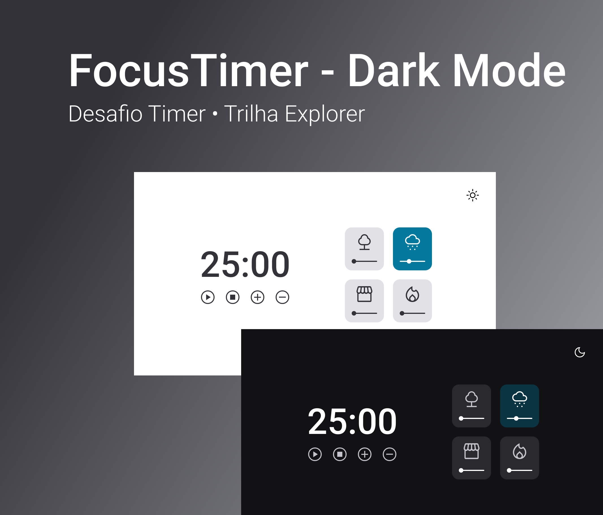

# FocusTimer - Versão Dark Mode

Aqui está o [link](https://www.figma.com/file/nlJJAVuGDc1tnDKqUW4FJA/Stage-05---Dark-Mode-FocusTimer/duplicate) com o layout da aplicação. Ele abrirá um arquivo igual a imagem abaixo:

# Sobre o desafio

1 - Funcionalidade do botão no canto superior direito:
É ali que você vai alternar entre o Dark Mode e o Light Mode.

2 - Funcionalidades dos botões:

- Play : aciona o timer;
- Stop : para o timer;
- &plus; : aumenta em mais 5 minutos o tempo do timer;
- &minus; : diminui em 5 minutos o tempo do timer.

3- Funcionalidade de um card:
Cada card que se encontra do lado direito, quando selecionado, vai mudar de cor e emitir um som diferente. Os sons você pode encontrar, respectivamente, nos links abaixo:

[**Floresta**](https://drive.google.com/file/d/1CRHkV72WUMdcqec5GT_KdsqFz0z3VAOA/view)

[**Chuva**](https://drive.google.com/file/d/1Ip8xBqAUJ-bty51Wz8JBtX_bWXCgA0P2/view)

[**Cafeteria**](https://drive.google.com/file/d/1OxLKpCwg2wrxXFNUHgZxJ51QEt0ac5RA/view)

[**Lareira**](https://drive.google.com/file/d/1MakaBPxJvTa_whaSM3kEbRcxiVd1GRCB/view)

Nessa versão, além disso, o volume deverá ser controlado pelo slider que está embaixo de cada ícone.

Obs: por padrão, quando você clicar em qualquer área de um card, você pode deixar o volume em 50%.
